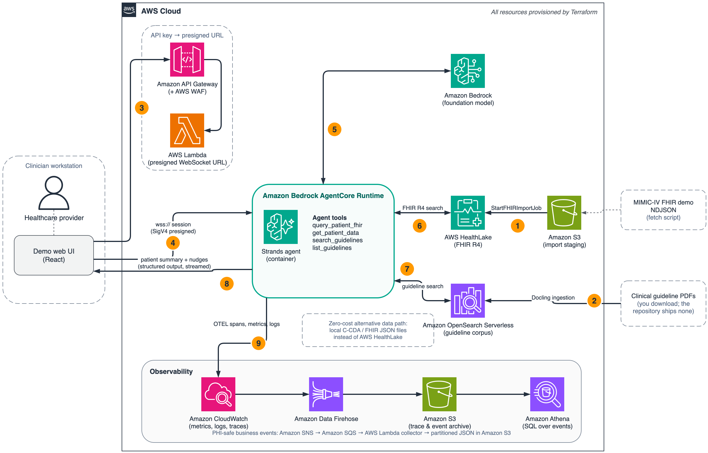

# Healthcare Decision Support Agent

Sample AI-powered healthcare decision support system that generates patient summaries and actionable recommendations (*nudges*) for healthcare providers using the Strands agent framework and Amazon Bedrock.

## Features

The system parses patient data from CCDA XML and FHIR JSON documents, generates clinical narratives tailored to specialty, and produces evidence-based recommendations grounded in clinical guidelines. It supports cardiology, endocrinology, and general practice with customizable prompts. OpenSearch provides full-text search over clinical guidelines. Observability includes CloudWatch metrics, X-Ray tracing, and OTEL trace capture.

## Architecture

<p align="center">
  
</p>

---

## Getting Started

### 1. Prerequisites

Install [uv](https://docs.astral.sh/uv/), a fast Python package manager:

```bash
# macOS/Linux
curl -LsSf https://astral.sh/uv/install.sh | sh

# Windows
powershell -ExecutionPolicy ByPass -c "irm https://astral.sh/uv/install.ps1 | iex"

# Or via Homebrew
brew install uv
```

You also need AWS credentials with Bedrock access.

### 2. Install Dependencies

```bash
uv sync

uv sync --extra dev --extra evals --extra ingest
```

### 3. Configure

```bash
cp config/settings.yaml.example config/settings.yaml
```

See [docs/configuration.md](docs/configuration.md) for details.

### 4. Get Clinical Guidelines (Prerequisite)

**This repository ships no guideline content.** The agent grounds every recommendation in a
clinical guideline passage, so you supply the guideline corpus yourself:

1. Review the source manifest at [`guidelines/sources.json`](guidelines/sources.json) — 39 discovery
   records with download links, licence status, and caveats (superseded editions, issued
   corrections, dead legacy URLs); 28 of them form the reference corpus the published results use.
2. Download the PDFs you are licensed to use into `guidelines/pdfs/`. `uv run
   scripts/fetch_guideline_pdfs.py` fetches every source that has a public route and
   writes a ledger of the ones that need a manual download (publisher bot walls; HTML-only
   pages need Chrome or Chromium on `PATH` to render). Each file is named after its
   manifest key, which becomes the source id at ingestion.
3. Ingest them into OpenSearch (see [Guidelines Ingestion](#guidelines-ingestion) below).
4. Add an entry to [`guidelines/catalog.json`](guidelines/catalog.json) for each document you
   ingested. That file ships empty on purpose: the `list_guidelines` tool reads it to tell the agent
   what it may cite, so listing a document you have not ingested makes the agent reference material
   it cannot retrieve.
5. **No OpenSearch?** Generate local summaries instead. `guidelines/summaries/` ships empty; the
   agent-executed [Guidelines Summarizer SOP](sops/guidelines-summarizer.sop.md) reads each PDF and
   writes one markdown summary per guideline under `guidelines/summaries/<SOURCE>/` plus the catalog
   entries from step 4. With `search_backend: auto` (the default in `settings.yaml.example`) the agent
   searches those summaries whenever no OpenSearch endpoint is configured.

The manifest spans critical care and emergency medicine as well as chronic disease and preventive
care, because the reference dataset (MIMIC-IV) is an ICU/ED population. If you evaluate on ICU
records, ingest the critical care sources — a corpus of outpatient guidelines will produce
recommendations that miss the clinical context entirely.

Guidelines published by US federal agencies (CDC, NIH, NHLBI, NIAID, NIA, HHS) are public domain.
Guidelines from professional societies (ADA, AHA/ACC, AASM, AAFP, AAO-HNSF, AAP) are copyrighted —
free to read, but **not** redistributable, which is why they are linked rather than included.

### 5. Get Sample Patient Data (Optional)

For testing with a single patient, use the included test fixture:

```bash
uv run scripts/run_inference.py --mode local --samples 1 --data-dir tests/fixtures --no-trace
```

For testing with 1,000 patients, download [Synthea sample data](https://synthetichealth.github.io/synthea-sample-data/):

```bash
mkdir -p data/sample-ccda data/sample-fhir

# Download CCDA sample data (~1K patients; the archive unpacks into a ccda/ subfolder)
curl -L -o synthea_ccda.zip \
  "https://raw.githubusercontent.com/synthetichealth/synthea-sample-data/main/downloads/synthea_sample_data_ccda_nov2021.zip"
unzip -j synthea_ccda.zip -d data/sample-ccda/

# Download FHIR R4 sample data (~1K patients)
# Pinned at commit a59acd4 — the synthea-sample-data repo has no tags or releases
curl -L -o synthea_fhir.zip \
  "https://raw.githubusercontent.com/synthetichealth/synthea-sample-data/a59acd49f50d240ce6bacc22a719fff8b25b8dc3/downloads/synthea_sample_data_fhir_r4_nov2021.zip"
unzip -j synthea_fhir.zip -d data/sample-fhir/
```

Synthea records are synthetic and will not reproduce the published MIMIC-IV numbers; they
are the zero-cost format-coverage path.

### 6. Run

Local runs (`--mode local`) need no AWS infrastructure beyond Bedrock model access: with
`search_backend: auto` and no OpenSearch endpoint, guideline search runs over
`guidelines/summaries/` (step 4.5). [ripgrep](https://github.com/BurntSushi/ripgrep) (`rg`) is
optional; a pure-Python search is used when it is not installed.

```bash
# Quick test with test fixture
uv run scripts/run_inference.py --mode local --samples 1 --data-dir tests/fixtures --no-trace

# Run with the Synthea sample data
uv run scripts/run_inference.py --mode local --samples 10 --data-dir data/sample-ccda

# Or use the Python API directly
uv run python examples/orchestrator_example.py
```

**Python API example:**

```python
from medical_nudging.agents.orchestrator import MedicalNudgingOrchestrator

orchestrator = MedicalNudgingOrchestrator(specialty="cardiology")

response = orchestrator.generate_nudges(
    ccda_xml=ccda_xml,
    visit_context={
        "visit_type": "ambulatory",
        "specialty": "cardiology",
        "chief_complaint": "Routine follow-up"
    }
)

print(f"Status: {response.status}")
print(f"Summary: {response.patient_summary}")
for nudge in response.nudges:
    print(f"- {nudge.title} [{nudge.urgency}]")
```

---

## Testing

```bash
uv run pytest              # Run all tests
uv run pytest -v           # Verbose output
uv run pytest --cov=medical_nudging  # With coverage
```

## Development

```bash
uv run black .             # Format code
uv run ruff check .        # Lint
uv run mypy src/           # Type check
uv run pre-commit install  # Install pre-commit hooks
```

## Guidelines Ingestion

Ingest PDF clinical guidelines into OpenSearch using [Docling](https://github.com/DS4SD/docling) for layout-aware text extraction and semantic chunking.

### Install ingestion dependencies

```bash
# macOS / AL2023 / Ubuntu — pre-built wheels available
uv sync --extra ingest

# Amazon Linux 2 — requires C++20 compiler for first-time build of docling-parse
sudo yum install -y gcc10 gcc10-c++ cmake3
CC=gcc10-gcc CXX=gcc10-g++ uv sync --extra ingest
# After the first install, the compiled wheel is cached and the CC/CXX prefix is not needed again.
```

### Run ingestion

```bash
# Dry run — parse PDF and inspect extraction quality (no OpenSearch needed)
uv run scripts/ingest_opensearch_docling.py /path/to/guidelines.pdf --dry-run --verbose

# Ingest a directory of PDFs into OpenSearch
uv run scripts/ingest_opensearch_docling.py /path/to/guidelines/ --recursive \
  --endpoint https://xxx.us-east-1.aoss.amazonaws.com --bucket my-guidelines-bucket

# Ingest from S3
uv run scripts/ingest_opensearch_docling.py s3://bucket/guidelines/ --recursive

# Per-source indices (e.g., guidelines-ada, guidelines-cdc)
uv run scripts/ingest_opensearch_docling.py /path/to/guidelines/ --recursive --per-source-index

# Verify indexed content
uv run python scripts/verify_opensearch.py
```

Docling runs on the CPU and holds several gigabytes per document; run one ingestion process
at a time (two in parallel on a 16 GB host were OOM-killed) and budget roughly 2 to 6 minutes
per guideline PDF on 8 cores. OCR of embedded images is the memory-hungry step: if a
native-text PDF is killed, re-run it with `--no-ocr` (under 3 GB, about a minute; the chunk
count differs by at most a handful). Chunk counts are otherwise deterministic for identical
PDF bytes.

## Scripts

```bash
# Inference
uv run scripts/run_inference.py --mode local --samples 10
uv run scripts/run_inference.py --mode agentcore --samples 10

# Analysis
uv run scripts/token_analysis.py

# Validate config defaults alignment
uv run scripts/validate_config_defaults.py

# Deployment quality loop (see docs/deployment-guide.md)
uv run python -m evals.agentcore_dataset publish --file config/evals/regression_dataset_v1.json
uv run python -m evals.agentcore_gate --runtime-arn <arn> --config config/evals/blog_opus5.json \
  --thresholds config/evals/regression_thresholds_v1.json --dataset-id <id> --dataset-version 1 \
  --output-dir ~/nudge-evaluations/gate
```

---

## Project Structure

```
src/medical_nudging/
├── agents/orchestrator.py    # Main entry point
├── api/                      # FastAPI backend (demo only, see note below)
├── parsers/                  # CCDA and FHIR parsers
├── search/                   # OpenSearch and ripgrep backends
├── tools/                    # Strands agent tools
├── tracing/                  # Observability, metrics, SNS events
├── config.py                 # YAML config loader
├── inference.py              # Inference helpers (local & AgentCore)
└── models.py                 # Response schemas

config/                       # settings.yaml and experiment configs
prompts/                      # LLM prompts and specialty instructions
guidelines/                   # Clinical guideline summaries (public-domain CDC content only — bring your own for other sources)
evals/                        # Strands layered evaluation and clinician-review tools
tests/                        # Test suite and fixtures
scripts/                      # CLI utilities
terraform/                    # AWS infrastructure
frontend/                     # React demo UI (demo only, see note below)
```

> **Note:** The `api/` module and `frontend/` directory are a reference demo UI and are not part of the core pipeline. Production deployments would integrate the agent with their own frontend or EHR system.

---

## Documentation

| Document | Description |
|----------|-------------|
| [docs/deployment-guide.md](docs/deployment-guide.md) | AWS deployment, candidate-acceptance gate, online evaluation |
| [docs/evaluation.md](docs/evaluation.md) | Four evaluation layers and where each runs |
| [docs/configuration.md](docs/configuration.md) | Environment variables and settings |
| [docs/pipeline.md](docs/pipeline.md) | Execution flow and data privacy |
| [docs/response-schema.md](docs/response-schema.md) | NudgeResponse schema and categories |
| [docs/observability-guide.md](docs/observability-guide.md) | CloudWatch, Athena, and tracing |
| [terraform/README.md](terraform/README.md) | Terraform infrastructure reference |
| [CLAUDE.md](CLAUDE.md) & [AGENTS.md](AGENTS.md) | AI assistant development guide |

### Additional Resources

- [Synthea Sample Data](https://synthetichealth.github.io/synthea-sample-data/) - Synthetic patient datasets
- [CCDA Standard (HL7)](https://www.hl7.org/implement/standards/product_brief.cfm?product_id=492) - Clinical document format
- [Synthea Overview](https://mitre.github.io/fhir-for-research/modules/synthea-overview) - Synthetic data generation

---

## Security

See [CONTRIBUTING](CONTRIBUTING.md#security-issue-notifications) for more information.

### Demo-grade defaults and hardening before production

The Terraform stack is a sample: it encrypts data at rest with customer-managed KMS keys,
scopes IAM to the stack's resources, keeps a year of CloudWatch logs, and fronts the only
client endpoint with API Gateway, an API-key authorizer, WAF, X-Ray tracing and access logs.
It deliberately leaves out controls a production deployment should add, and static scanners
will list them:

- S3 bucket versioning, access logging, and cross-region replication
- Lambda functions inside a VPC, dead-letter queues, code signing, reserved concurrency, and X-Ray tracing
- API Gateway request validation and WAF logging
- Secrets Manager automatic rotation of the API key
- CodeBuild with a customer-managed key (it also runs privileged, which the Docker image build requires)
- ECR immutable tags

The agent container binds `0.0.0.0:8080` because Amazon Bedrock AgentCore requires it, and
the CodeBuild project runs in privileged mode for Docker-in-Docker; neither is configurable.
Nothing in the sample exposes an unauthenticated endpoint.

## License

This library is licensed under the MIT-0 License. See the [LICENSE](LICENSE) file.

**Disclaimer:** This sample is for demonstration purposes only and is not intended for clinical use. It does not provide medical advice and must not be used to make decisions about patient care without review by qualified healthcare professionals.

For generation comparisons, evidence checks, judge controls, and clinician review,
see [the evaluation guide](docs/evaluation.md#running-the-evaluations).
