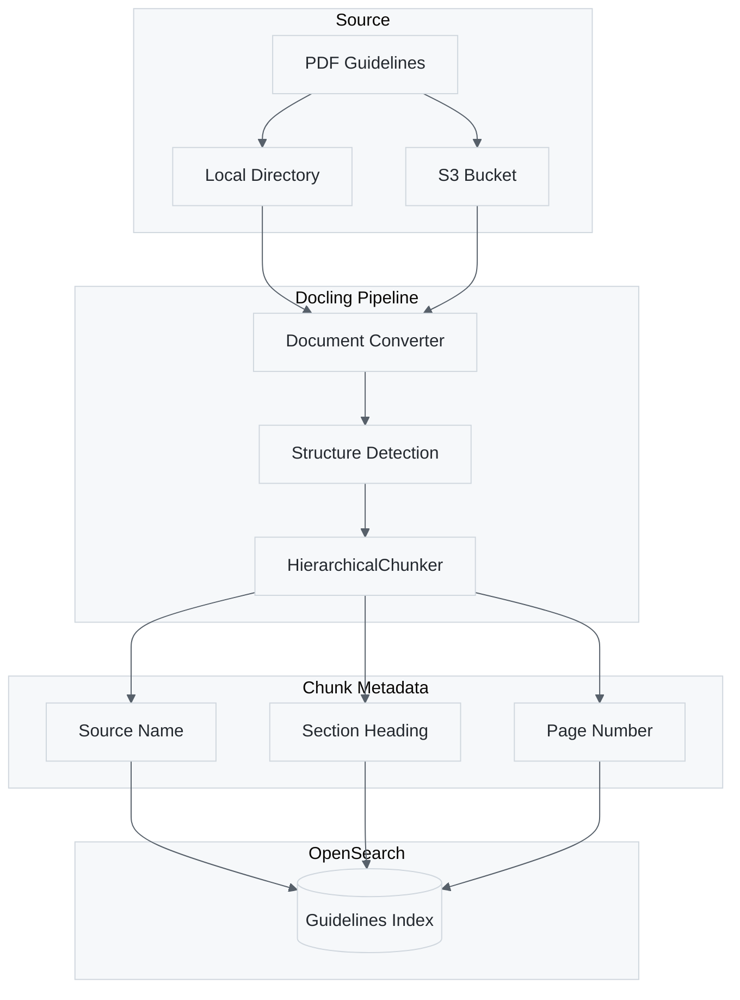

# Guidelines Knowledge Base: Architecture and Ingestion

Document Type: Technical Reference

> **This repository ships no clinical guideline content.** Clinical practice guidelines from
> professional societies (ADA, AHA/ACC, AASM, AAFP, AAO-HNSF, AAP) are copyrighted and cannot be
> redistributed here, even though most are free to read. Building the knowledge base is a
> **prerequisite you complete yourself**: download the PDFs you are licensed to use from the
> sources listed in [`guidelines/catalog.json`](../guidelines/catalog.json), then ingest them as
> described below. Documents authored by US federal agencies (CDC, NIH, NHLBI, NIAID, NIA, HHS)
> are public domain and can be used without restriction.

## Executive Summary

This document describes how the system creates and uses a clinical guidelines knowledge base powered by OpenSearch Serverless. The knowledge base enables the agent to retrieve relevant guideline passages when generating patient nudges. We transitioned from a Lambda-based ingestion pipeline to a local shell script using Docling for PDF extraction after finding that Docling produces cleaner text output without affecting end-to-end nudge quality.

## Knowledge Base Architecture

The guidelines knowledge base stores chunked text from clinical guideline PDFs (e.g. ADA, AHA/ACC, CDC) in an OpenSearch Serverless collection. When the agent processes a patient record, it searches this index to retrieve relevant guideline passages that inform the nudges.


The search flow works as follows. The agent receives patient data containing conditions, medications, and lab values. Based on this clinical context, the agent formulates search queries such as "diabetes HbA1c management" or "statin therapy cardiovascular risk." OpenSearch returns the top matching passages with source attribution. The agent then uses these passages to ground its nudges in evidence-based guidelines, citing the source document and section in each recommendation.

OpenSearch Serverless provides the search infrastructure. We chose Serverless over managed OpenSearch because it eliminates cluster management overhead and scales automatically with query volume. The collection uses the SEARCH type optimized for full-text retrieval. Terraform provisions the collection along with required encryption, network, and data access policies. The index schema stores each chunk with metadata including source name, section title, page number, and ingestion timestamp.

## PDF Extraction: Docling vs. pdfplumber

We evaluated two PDF extraction approaches before settling on Docling. The original ingestion script used pdfplumber, a Python library that extracts text page by page with fixed-size chunking. This approach worked but produced artifacts when processing multi-column layouts common in medical guidelines. Text from adjacent columns would concatenate incorrectly, producing garbled passages like `"insulinpermonthfoerallMedicarebenefi-cluding food insecurity"`.

Docling, developed by IBM, uses document understanding models to parse PDF structure before extraction. It identifies columns, tables, headers, and sections, then extracts text in logical reading order. The HierarchicalChunker creates semantically meaningful chunks that respect section boundaries rather than splitting mid-sentence.

Our comparison found that both approaches produce qualitatively similar nudges. The LLM proved robust to noisy input and could extract meaning from garbled pdfplumber passages. However, Docling offers two advantages that justified the switch. First, cleaner passages improve auditability so clinicians reviewing nudge citations see readable source text rather than concatenation artifacts. Second, semantic chunking reduces the risk of retrieval failures where relevant content spans a chunk boundary.

The comparison also revealed that the two approaches retrieve different content from the same source documents. With only 22% word overlap between retrieved passages, the chunking strategy determines what information surfaces during search. In one test case, pdfplumber found an SDOH screening recommendation that Docling missed because the content fell within different chunk boundaries. This finding suggests that chunk coverage matters more than text cleanliness for retrieval quality.

## Ingestion Process

The ingestion script processes PDF files from local directories or S3 and indexes them into OpenSearch. We use a local CLI script rather than Lambda-triggered ingestion because Docling downloads large ML models (500MB to 2GB) on first use, which exceeds Lambda's 10-second initialization timeout. A future production phase will migrate to ECS Fargate for automated S3-triggered ingestion.



To ingest guidelines run the script against your PDF directory.

```bash
uv run scripts/ingest_opensearch_docling.py guidelines/pdfs/ --recursive
```

For each PDF, the script derives a source name from the file path, extracting organization (ADA, AHA_ACC, CDC) and year from directory structure and filename. Docling converts the PDF to a structured document representation, identifying sections, tables, and paragraphs. The HierarchicalChunker splits the document into chunks that preserve semantic boundaries. The script then indexes each chunk with metadata including source, section heading, page number, and chunk type.

For initial testing, use the dry-run flag to inspect extraction quality without indexing. The verbose flag displays sample chunks with their headings and content previews.

```bash
uv run scripts/ingest_opensearch_docling.py guidelines/pdfs/ADA/ada-2026.pdf --dry-run --verbose
```

When re-ingesting updated guidelines, use the clear-existing flag to delete previous documents for that source before indexing new content. This prevents duplicate chunks from accumulating across ingestion runs.

```bash
uv run scripts/ingest_opensearch_docling.py guidelines/pdfs/ADA/ada-2026.pdf --clear-existing
```

## Index Schema

The OpenSearch index uses the following mapping to support full-text search with source filtering.

| Field | Type | Purpose |
|-------|------|---------|
| source | keyword | Guideline identifier (e.g., "ADA 2026") for filtering |
| section | text | Section heading, analyzed with English analyzer |
| page_number | integer | Original PDF page for citation |
| content | text | Chunk text, analyzed with English analyzer |
| hierarchy | keyword | Document structure path from Docling |
| chunk_type | keyword | Paragraph, table, list, or other element type |
| ingested_at | date | Timestamp for tracking freshness |

The English analyzer applies stemming and stop word removal to improve recall. Term vectors enable highlighting of matched terms in search results.

## Infrastructure Setup

Terraform creates the OpenSearch Serverless collection with required security policies. The encryption policy enables AWS-owned key encryption. The network policy controls public access. Disable public access for production deployments. The data access policy grants index and document permissions to the AWS account.

To provision the infrastructure, apply the Terraform configuration with OpenSearch enabled.

```bash
cd terraform
terraform apply -var="opensearch_enabled=true"
```

After Terraform completes you can retrieve the collection endpoint from the outputs.

```bash
terraform output -raw opensearch_endpoint
```

The collection takes 2 to 5 minutes to reach ACTIVE status after creation. Running the ingestion script before the collection reaches ACTIVE status causes connection errors.

## Appendix: pdfplumber vs. Docling Side-by-Side Search Comparison

The following examples show the top search result from each index (`guidelines` using pdfplumber extraction, `guidelines-docling` using Docling extraction) for the same query. These illustrate the differences in text quality, chunking, and retrieved content between the two approaches.

**Index statistics:**
- `guidelines` (pdfplumber): 2,361 documents
- `guidelines-docling` (Docling): 4,963 documents

### Example 1: Statin Therapy and Cardiovascular Risk

**Query:** `statin therapy cardiovascular risk LDL cholesterol`

**pdfplumber** (score: 24.18) — Source: acc-aha 2025, Page 27
> ```
> Rao et al 2025 Acute Coronary Syndromes Guideline
> fondaparinux significantly reduced the risk of the ezetimibe, monoclonal antibodies to proprotein conver-
> primary endpoint of death or reinfarction at 30 tase subtilisin/kexin type 9 (PCSK9), and bempedoic
> days, including a significant reduction in mortality, acid, can both lower LDL-C levels and improve ASCVD
> reinfarction, and severe bleeding when compared outcomes across diverse populations.5–10 Inclisiran also
> with placebo or UFH.27,30 lowers LDL-C levels by preventing translation of PCSK9
>                                                    mRNA, but clinical outcomes studies are not yet avail-
>                                                    able (Table 12). Nonetheless, the relative benefit of
> 4.5. Lipid Management                              LDL-C–lowering therapies is expected to be proportional
> ```
Multi-column text concatenation visible — left and right columns are merged line by line, interleaving unrelated sentences (fondaparinux and ezetimibe content mixed together).

**Docling** (score: 29.54) — Source: ADA 2026, Section: Initiating Statin Therapy
> ```
> the beneficial effects of statin therapy on ASCVD outcomes in subjects with and
> without established ASCVD (92,93). Subgroup analyses of people with diabetes in
> larger trials (94-98) and trials in people with diabetes (99,100) showed significant
> primary and secondary prevention of ASCVD events and coronary heart disease (CHD)
> death in people with diabetes. Meta-analyses including data from > 18,000 people
> with diabetes from 14 randomized trials of statin therapy (mean follow-up 4.3 years)
> demonstrated a 9% proportional reduction in all-cause mortality and 13% reduction in
> vascular mortality for each 1 mmol/L (39 mg/dL) reduction in LDL cholesterol (101).
> ```
Clean continuous prose with logical reading order preserved. Section heading correctly identifies the content as statin therapy guidance.

---

### Example 2: Hypertension and Blood Pressure Goals

**Query:** `hypertension blood pressure treatment goals`

**pdfplumber** (score: 12.59) — Source: ADA 2026, Page 224
> ```
> S218 Cardiovascular Disease and Risk Management Diabetes Care Volume 49, Supplement 1, January 2026
> n
> o
> i
> t
> a
> REDUCTION IN DIABETES COMPLICATIONS i
> c
> o
> s
> s
> Agents with
> Glycemic Blood pressure Lipid Acardiovascular
> management management management and kidney
> benefit
> s
> e
> t
> e
> b
> LIFEaSTYLE MODIFICATION
> AND DIABETES EDUCATION
> i
> D
> Figure 10.1—Multifactorial approach to reduction in risk of diabetes complications.
> ```
Single-character vertical text artifacts from a figure/diagram extracted as text. The actual clinical content about blood pressure goals is buried after several lines of figure noise.

**Docling** (score: 21.51) — Source: ADA 2026, Section: Recommendations
> ```
> Randomized clinical trials have demonstrated unequivocally that treatment of
> hypertension reduces cardiovascular events as well as microvascular complications
> (34-40). There has been controversy on the recommendation of a specific blood
> pressure goal in people with diabetes. The recommendation to support a blood
> pressure goal of < 130/80 mmHg in people with diabetes is consistent with guidelines
> from the American College of Cardiology and American Heart Association (24), the
> International Society of Hypertension, and the European Society of Cardiology/
> European Society of Hypertension Blood Pressure/Hypertension Guidelines (26).
> ```
Docling skips the figure entirely and extracts the surrounding clinical text. The passage directly states the blood pressure goal of <130/80 mmHg.

---

### Example 3: Immunization Schedule (Table Extraction)

**Query:** `immunization vaccination schedule adults`

**pdfplumber** (score: 19.4) — Source: ada 2026, Page 73
> ```
> Table 4.3—Highly recommended immunizations for people with diabetes (from the Advisory
> Committee on Immunization Practices and Centers for Disease Control and Prevention)
> GRADE n
> evidence
> Vaccine Recommended ages Schedule type* References o
> COVID-19 All people 6 months of age and Current initial vaccination 3 Centers for Disease Control and
> older and boosters Prevention, Interim iClinical
> Considerations fotr Use of
> COVID-19 Vaaccines in the
> United States (305)
> i
> Hepatitis B Adults with diabetes aged - 1 Sandul et al., Updated
> c
> <60 years; for adults aged Recommendation for Universal
> ≥60 years, hepatitis B vaccine Hepatitis B Vaccination in Adults
> o
> may be administered at the Aged 19–59 Years - U
> ```
Table columns are partially merged. Stray single characters (`n`, `o`, `i`, `c`) appear from vertical sidebar text. Column alignment is lost, making it difficult to associate vaccines with their schedules.

**Docling** (score: 24.2) — Source: ADA 2026, Section: Recommendations
> ```
> Table 4.3-Highly recommended immunizations for people with diabetes (from the Advisory
> Committee on Immunization Practices and Centers for Disease Control and Prevention)
>
> COVID-19, Recommended ages = All people 6 months of age and older. COVID-19,
> Schedule = Current initial vaccination and boosters. COVID-19, GRADE evidence
> type* = 3. COVID-19, References = Centers for Disease Control and Prevention,
> Interim Clinical Considerations for Use of COVID-19 Vaccines in the United States (305).
> Hepatitis B, Recommended ages = Adults with diabetes aged < 60 years; for adults
> aged ≥ 60 years, hepatitis B vaccine may be administered at the discretion of the
> treating clinician based on the person's likelihood of acquiring hepatitis B infection.
> ```
Table is linearized into a structured key-value format (e.g., `COVID-19, Recommended ages = ...`). Each cell is clearly associated with its row and column, making the content unambiguous for LLM consumption.

---

### Example 4: SDOH Screening

**Query:** `social determinants of health SDOH screening`

**pdfplumber** (score: 13.28) — Source: ADA 2026, Page 115
> ```
> PSYCHOSOCIALCARE psychologicalsymptomsisessentialto (especiallyrelatedtostartinganewtreat-
> comprehensivecare. mentortechnology),generalanddiabetes-
> Recommendations
> Diabetes health care professionals relatedmood,stress,and/orqualityoflife
> 5.42 Provide psychosocial care to all n
> should routinely monitor and screen for (e.g., diabetes distress, depressive symp-
> people with diabetes as part of rou-
> psychosocialconcernsinatimelyandeffi- toms,anxietysymptoms,andfearofhypo-
> o
> tinemedicalcaredeliveredbytrained cient manner and refer to appropriate glycemia), available resources (financial,
> health care professionals using a
> services (387,388). Psychosocial care can social,family,andemotionail),and/orpsy-
> collaborative,
> ```
Multi-column merge artifacts produce concatenated words without spaces: `psychologicalsymptomsisessentialto`, `mentortechnology`, `psychosocialconcernsinatimelyandeffi-`. Despite garbling, the LLM can still parse the meaning.

**Docling** (score: 18.0) — Source: ADA, Section: Evidence for the Benefits
> ```
> Social determinants of health (SDOH) are an important aspect of diabetes care and
> should be assessed and weighed in guiding the design and delivery of DSMES. The
> DSMES team needs to consider characteristics such as racial identity, ethnic and
> cultural background, biological sex and gender identity, age, geographic location,
> technology access, education, literacy, and numeracy (13). Barriers to equitable DSMES
> access can be mitigated by assessing the impact of the individual's SDOH and
> leveraging creative delivery options (e.g., telehealth and online) that will work best
> for the population in need of DSMES (10).
> ```
Clean prose with proper word boundaries and readable citations. Directly addresses SDOH in diabetes care context.

---

### Example 5: GLP-1 RA and SGLT2 Inhibitors

**Query:** `GLP-1 receptor agonist SGLT2 inhibitor`

**pdfplumber** (score: 19.04) — Source: AHA_ACC 2023, Page 41
> ```
> JACC VOL. 82, NO. 9, 2023 Viranietal 873
> AUGUST 29, 2023:833–955 2023AHA/ACC/ACCP/ASPC/NLA/PCNAChronicCoronaryDiseaseGuideline
> "Team-Based Approach") should guide shared decision- assumptions regarding underlying risk and are likely
> making(Section4.1.3)aboutglycemictargetsandthede- applicabletopatientswithCCD.
> cision to initiate an SGLT-2 inhibitor, GLP-1 receptor 4. AmongpatientswithHFwithreducedejectionfraction
> agonist,orboth.39 (with or without type 2 diabetes), SGLT2 inhibitors
>                                                        reduce the risk of cardiovascular deathand HF hospi-
> Recommendation-SpecificSupportiveText               talization19-22 and improve functional capacity and
> 1. In patients withCCD and type 2 diabetes,both SGLT2 QOL.23,24 These effects were independent of cause of
> inhibitors and GLP-1 receptor agonists significantly cardiomyop
> ```
Two-column merge with concatenated words (`applicabletopatientswithCCD`, `deathand`, `cardiomyop` truncated). Journal header/footer noise included in chunk.

**Docling** (score: 24.29) — Source: ADA, Section: Table 11.3-Interventions that lower albuminuria
> ```
> ARB, angiotensin receptor blocker; GLP-1 RA, glucagon-like peptide 1 receptor
> agonist; MRA, mineralocorticoid receptor antagonist; SGLT2, sodium-glucose
> cotransporter 2.
> ```
Short abbreviation legend chunk — semantically correct but less content. Docling's smaller chunk size means a table legend gets its own document, which matches precisely but provides less clinical context than the pdfplumber passage.

---

### Example 6: Obesity and BMI Screening

**Query:** `obesity weight management BMI`

**pdfplumber** (score: 11.03) — Source: ADA 2026, Page 173
> ```
> measure adipose tissue distribution or increase their awareness of implicit and ex-
> (e.g., "person with obesity" rather than
> function, and it does not factor in the pres- plicit weight-biased attitudes (31,32). In-
> "obese person" and "person with dia-
> ence of weight-related health or well-being creasing empathy and understanding about
> betes" rather than "diabetic person"). E n
> 8.2a Screen for overweight and obe-
> prone to misclassification in individuals among health care professionals is a useful
> sity using BMI annually. To confirm ex- o
> who are very muscular (athletes) or in avenue to help reduce weight bias (33).
> cess adiposity, additional assessments
> ```
Three-column interleaving: recommendation text, commentary, and person-first language guidance all merged into alternating lines.

**Docling** (score: 15.72) — Source: ADA 2026, Section: Recommendations
> ```
> (e.g., 'person with obesity' rather than 'obese person' and 'person with diabetes'
> rather than 'diabetic person'). E
> 8.2a Screen for overweight and obesity using BMI annually. To confirm excess
> adiposity, additional assessments of body fat using anthropometric assessments
> (e.g., waist-to-hip ratio) or direct measurements (e.g., dual-energy X-ray
> absorptiometry, bioelectrical impedance analysis) could be considered where
> available/feasible. E
> 8.2b Monitor obesity-related anthropometric measurements at least annually to
> inform treatment considerations. During active weight management treatment,
> increase monitoring to at least every 3 months. E
> 8.3 Accommodations should be made to provide privacy during anthropometric
> measurements. E
> ```
Recommendations are clearly numbered and sequential. Each recommendation (8.2a, 8.2b, 8.3) flows continuously without interleaved text from adjacent columns.

---

### Summary of Observed Differences

| Aspect | pdfplumber (`guidelines`) | Docling (`guidelines-docling`) |
|--------|--------------------------|-------------------------------|
| **Multi-column layouts** | Columns merged line-by-line, producing interleaved sentences | Logical reading order preserved |
| **Tables** | Column alignment lost, headers/data mixed | Linearized key-value format, unambiguous cell association |
| **Figure/diagram text** | Vertical text extracted as single characters | Figures skipped, surrounding text extracted cleanly |
| **Word boundaries** | Concatenated words without spaces (e.g., `applicabletopatientswithCCD`) | Proper spacing throughout |
| **Chunk size** | 2,361 larger fixed-size chunks | 4,963 smaller semantic chunks |
| **Section metadata** | Section headings often garbled or truncated | Clean section headings from document structure |
| **Journal noise** | Page headers/footers included in chunks | Boilerplate removed |
| **LLM robustness** | LLM can still parse garbled text in most cases | Clean text reduces interpretation burden |
| **Content coverage** | Different chunk boundaries surface different content | Different chunk boundaries surface different content |
