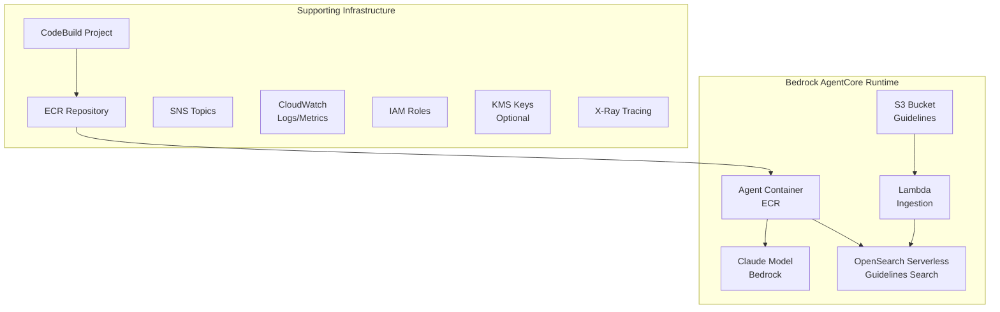

# Medical Nudging Pilot - Terraform Infrastructure

This directory contains Terraform configuration for deploying the Medical Nudging Pilot infrastructure on AWS.

## Overview

The infrastructure deploys a clinical decision support system using Amazon Bedrock AgentCore:

- **Bedrock AgentCore Runtime**: Main agent for generating patient nudges
- **OpenSearch Serverless**: Full-text search over clinical guidelines
- **ECR Repository**: Container registry for agent Docker images
- **S3 Buckets**: Storage for guidelines PDFs and source code
- **HealthLake** (optional): FHIR R4 datastore for the MIMIC-IV demo data path
- **CloudWatch**: Logs, metrics, alarms, and dashboards
- **KMS**: Encryption keys for all resources (optional)
- **SNS**: Event notifications and alerting

## Architecture



## What You Can Do After Deployment

After deployment, you can submit patient data (CCDA XML or FHIR JSON) to the agent and receive evidence-based clinical recommendations with citations. Use the inference script for testing or integrate with your own applications.

You can upload PDF guidelines to S3 for automatic indexing into OpenSearch. The Lambda function processes uploads automatically. Search guidelines via OpenSearch to verify content or update guidelines by uploading new versions.

For monitoring, view agent invocation logs in CloudWatch, track latency and errors via CloudWatch metrics, and debug issues using X-Ray distributed tracing. Enable CloudWatch alarms to receive SNS notifications for failures.

For integration, invoke the agent programmatically using the AWS SDK, build custom frontends using the agent's REST API, or connect to existing EHR systems for automated nudge generation.

## Prerequisites

### Required

1. **AWS CLI v2** - Installed and configured
   ```bash
   aws --version  # Requires 2.x
   ```

2. **Terraform** - v1.5.0 or later
   ```bash
   terraform --version
   ```

3. **Python** - v3.9 or later (required by Terraform scripts)

   **Linux/macOS:**
   ```bash
   python3 --version  # or python --version
   ```

   **Windows:**
   ```powershell
   python --version
   ```

4. **uv** (Optional) - For running inference tests after deployment

   ```bash
   # Install uv (https://docs.astral.sh/uv/)
   curl -LsSf https://astral.sh/uv/install.sh | sh  # Linux/macOS
   # or
   powershell -ExecutionPolicy ByPass -c "irm https://astral.sh/uv/install.ps1 | iex"  # Windows
   ```

5. **AWS Credentials** - Configured via any standard method

   **Linux/macOS (Bash):**
   ```bash
   # Option A: Use a named profile
   export AWS_PROFILE=your-aws-profile

   # Option B: Use environment variables
   export AWS_ACCESS_KEY_ID=...
   export AWS_SECRET_ACCESS_KEY=...

   # Option C: Use IAM role (EC2/ECS/CloudShell)
   # No configuration needed

   # Verify access
   aws sts get-caller-identity
   ```

   **Windows (PowerShell):**
   ```powershell
   # Option A: Use a named profile
   $env:AWS_PROFILE = "your-aws-profile"

   # Option B: Use environment variables
   $env:AWS_ACCESS_KEY_ID = "..."
   $env:AWS_SECRET_ACCESS_KEY = "..."

   # Verify access
   aws sts get-caller-identity
   ```

   > **Note:** The `aws_profile` variable in `terraform.tfvars` is optional. If not set, Terraform uses your default AWS credentials.

### Required AWS Permissions

The deploying IAM user/role needs permissions for:
- Bedrock AgentCore (control plane, datasets, configuration bundles, online evaluation) and Bedrock model invocation
- ECR (create/manage repositories)
- S3 (create/manage buckets)
- OpenSearch Serverless (collections, security and access policies)
- HealthLake, plus `ram:GetResourceShareInvitations` (CreateFHIRDatastore checks it on the caller) and the Cloud Control API actions (`cloudformation:*Resource*`) the `awscc` provider uses - if `healthlake_enabled`
- AWS Budgets - if `healthlake_enabled`
- Lambda (create/manage functions)
- IAM (create/manage roles and policies, `iam:PassRole` to bedrock-agentcore, codebuild, lambda, healthlake, firehose, logs, apigateway)
- CloudWatch Logs, metrics, dashboards, and X-Ray (transaction search)
- KMS (create/manage keys) - if encryption enabled
- SNS and SQS (topics and queues)
- CodeBuild (create/manage projects, start builds)
- Kinesis Data Firehose, Glue, and Athena - if `enable_datalake_observability` (the default)
- API Gateway, WAF, and Secrets Manager - if `websocket_api_enabled` (the default)

[`deployer-policy.example.json`](deployer-policy.example.json) is a least-privilege
deployer policy that was verified end to end with a fresh stack: service-scoped actions,
resources limited to `<stack_name>*` names where the service supports it, and `iam:PassRole`
limited to the services above. Replace `<account-id>` and `<stack_name>`.

Two timing notes from a fresh-account deploy: the first CodeBuild build can be rejected
seconds after its role is created ("does not allow AWS CodeBuild to create Amazon
CloudWatch Logs log streams"); `wait_for_codebuild.py` retries it. And a HealthLake
datastore took 2 to 3 minutes to create, not the 10 to 30 minutes older documentation quotes.

## Configuration

### Create Variable File

Create a `terraform.tfvars` file with your configuration:

```hcl
# terraform.tfvars

# Region (optional - defaults to us-east-1)
# aws_region = "us-east-1"

# Core Configuration
stack_name  = "medical-nudging"
agent_name  = "MedicalNudging"
environment = "dev"  # dev, staging, or prod

# Network Mode
network_mode = "PUBLIC"  # PUBLIC or PRIVATE

# Agent Settings
log_level  = "INFO"   # DEBUG, INFO, WARNING, ERROR
max_nudges = 5        # 1-20
model_id   = "us.anthropic.claude-sonnet-5"

# OpenSearch (Guidelines Search)
opensearch_enabled         = true
opensearch_index_name      = "guidelines"
opensearch_standby_replicas = "DISABLED"  # ENABLED for production
opensearch_allow_public    = true         # Set to false for production

# Search Backend
search_backend = "opensearch"  # opensearch, ripgrep, or auto

# Observability
log_retention_days           = 30
enable_cloudwatch_dashboard  = true
enable_cloudwatch_alarms     = false  # Enable for production
enable_log_data_protection   = true   # Masks PHI in logs

# Security
enable_kms_encryption = true  # Recommended (~$5/month extra)

# S3 (optional - override default bucket naming)
# guidelines_bucket_name = "my-custom-guidelines-bucket"

# Container
image_tag = "latest"
```

### Key Variables Reference

| Variable | Description | Default |
|----------|-------------|---------|
| `aws_region` | AWS region for deployment | `us-east-1` |
| `stack_name` | Prefix for all resource names | `medical-nudging` |
| `agent_name` | AgentCore runtime name | `MedicalNudging` |
| `environment` | Deployment environment | `dev` |
| `network_mode` | `PUBLIC` or `PRIVATE` | `PUBLIC` |
| `opensearch_enabled` | Enable OpenSearch Serverless | `true` |
| `opensearch_standby_replicas` | `ENABLED` or `DISABLED` | `DISABLED` |
| `search_backend` | `opensearch`, `ripgrep`, or `auto` | `opensearch` |
| `log_retention_days` | CloudWatch log retention | `30` |
| `enable_kms_encryption` | Enable KMS encryption | `true` |
| `enable_cloudwatch_dashboard` | Create monitoring dashboard | `true` |
| `enable_cloudwatch_alarms` | Create CloudWatch alarms | `false` |
| `enable_log_data_protection` | Mask PHI in logs | `true` |
| `model_id` | Bedrock model ID | `us.anthropic.claude-sonnet-5` |
| `guidelines_bucket_name` | Custom S3 bucket name for guidelines | `{stack_name}-guidelines` |
| `fhir_datastore_arn` | Existing HealthLake datastore the runtime may read (when `healthlake_enabled` is false) | `null` |

### Deployment-quality loop (`evaluation.tf`)

| Variable | Description | Default |
|----------|-------------|---------|
| `candidate_gate_enabled` | Create the CodeBuild project that runs the frozen regression dataset against the deployed runtime | `true` |
| `run_candidate_gate_on_apply` | Run the gate during `terraform apply`; a failing gate fails the apply | `false` |
| `regression_dataset_id` / `regression_dataset_version` | Published AgentCore dataset version the gate pins (empty: use `regression_dataset_file`) | `""` |
| `regression_dataset_file` | Checked-in dataset fallback | `config/evals/regression_dataset_v1.json` |
| `regression_gate_config` / `regression_gate_thresholds` | Arm config and frozen thresholds | `config/evals/blog_opus5.json`, `config/evals/regression_thresholds_v1.json` |
| `gate_agentcore_evaluators` | AgentCore evaluators applied to collected spans (trend signals) | `Builtin.GoalSuccessRate` |
| `online_evaluation_enabled` | Create the AgentCore online evaluation configuration (costs evaluator invocations per sampled session) | `false` |
| `online_evaluation_sampling_percentage` | Sessions evaluated, 0.01–100 | `1.0` |
| `online_evaluation_evaluators` | Built-in or custom evaluator ids (max 10) | `Builtin.GoalSuccessRate` |
| `online_evaluation_session_timeout_minutes` | Idle minutes before a session counts as complete | `15` |
| `online_evaluation_log_group_names` | Log groups the evaluation reads spans from | `["aws/spans"]` |

See [docs/deployment-guide.md](../docs/deployment-guide.md#candidate-acceptance-gate-and-online-evaluation) for the workflow.

### Private Network Mode

For `PRIVATE` network mode, additional configuration is required:

```hcl
network_mode       = "PRIVATE"
vpc_id             = "vpc-xxxxxxxx"
private_subnet_ids = ["subnet-aaaaa", "subnet-bbbbb"]
```

## Deployment

### Step 1: Initialize Terraform

```bash
cd terraform
terraform init
```

Expected output:
```
Terraform has been successfully initialized!
```

### Step 2: Validate Configuration

```bash
terraform validate
```

### Step 3: Review Plan

```bash
terraform plan -out=tfplan
```

Review the planned changes carefully. With the defaults (KMS encryption, data lake
observability, the candidate gate) the initial deployment creates about 125 resources;
turning those off brings it under 60.

### Step 4: Apply Configuration

```bash
terraform apply tfplan
```

Or apply directly (will prompt for confirmation):
```bash
terraform apply
```

The deployment takes 10-15 minutes. OpenSearch Serverless collection creation is the longest step at 5 minutes.

### Step 5: Verify Deployment

```bash
# Check outputs
terraform output

# Test agent invocation
terraform output invoke_command
# Copy and run the output command
```

## Post-Deployment

### Ingest Clinical Guidelines

Uploading a PDF to the guidelines bucket does not index it; ingestion is the local
Docling script, which uploads each PDF to the bucket and writes its chunks to the
collection (see [Guidelines Ingestion](../README.md#guidelines-ingestion)):

```bash
cd ..
uv run scripts/fetch_guideline_pdfs.py            # best-effort download into guidelines/pdfs/
uv run scripts/ingest_opensearch_docling.py guidelines/pdfs/ --recursive \
  --index "$(terraform -chdir=terraform output -raw opensearch_index_name 2>/dev/null || echo guidelines)" \
  --endpoint "$(terraform -chdir=terraform output -raw opensearch_collection_endpoint)" \
  --bucket "$(terraform -chdir=terraform output -raw guidelines_bucket_name)"
uv run --extra ingest python scripts/build_guideline_catalog.py --index <index> --expected-sources <n>
```

The index name must match the runtime's `opensearch_index_name` (and, for the candidate
gate, the dataset's frozen `corpus_version`). Budget about 5 minutes of CPU per
100-page PDF on an 8-core host.

### Verify OpenSearch Ingestion

```bash
# Get OpenSearch endpoint
OPENSEARCH_ENDPOINT=$(terraform output -raw opensearch_collection_endpoint)

# Check index exists (requires awscurl - install via: uv tool install awscurl)
awscurl --service aoss -X GET "$OPENSEARCH_ENDPOINT/guidelines/_count"

# Alternative: Use the AWS Console OpenSearch Dashboards
# terraform output opensearch_dashboard_endpoint
```

### Access CloudWatch Dashboard

```bash
# Get dashboard URL
terraform output cloudwatch_dashboard_url
```

Or navigate manually:
1. AWS Console → CloudWatch → Dashboards
2. Find dashboard: `{stack_name}-monitoring`

### Test the Agent

The recommended way to test the deployed agent is using the inference script:

```bash
# Navigate to project root
cd ..

# Update config/settings.yaml with deployed values
# agent_arn: <from terraform output agent_runtime_arn>
# opensearch_endpoint: <from terraform output opensearch_collection_endpoint>

# Run inference test with AgentCore mode (2 samples: 1 CCDA, 1 FHIR)
uv run scripts/run_inference.py --mode agentcore --samples 2

# Run with more samples
uv run scripts/run_inference.py --mode agentcore --samples 10
```

Expected output shows success/error counts, latency metrics, and nudge categories:

```
┏━━━━━━━━━━━━━━━━┳━━━━━━━━━━━┓
┃ Metric         ┃     Value ┃
┡━━━━━━━━━━━━━━━━╇━━━━━━━━━━━┩
│ Total Samples  │         2 │
│ Success        │         2 │
│ Errors         │         0 │
│ Avg Latency    │    15000ms│
└────────────────┴───────────┘
```

**Note:** The AgentCore API differs from the standard Bedrock Agent API. Use the inference script for testing rather than `aws bedrock-agent-runtime invoke-agent`.

## Outputs

After deployment, Terraform provides these outputs:

### AgentCore
| Output | Description |
|--------|-------------|
| `agent_runtime_id` | Agent runtime identifier |
| `agent_runtime_arn` | Agent runtime ARN |
| `agent_runtime_name` | Agent runtime name |

### ECR
| Output | Description |
|--------|-------------|
| `ecr_repository_url` | Full ECR repository URL |
| `ecr_repository_arn` | ECR repository ARN |

### S3
| Output | Description |
|--------|-------------|
| `guidelines_bucket_name` | Guidelines S3 bucket name |
| `guidelines_bucket_arn` | Guidelines S3 bucket ARN |
| `source_bucket_name` | Source code S3 bucket name |

### OpenSearch
| Output | Description |
|--------|-------------|
| `opensearch_collection_endpoint` | OpenSearch endpoint URL |
| `opensearch_dashboard_endpoint` | OpenSearch Dashboards URL |
| `opensearch_collection_arn` | Collection ARN |

### Deployment-quality loop
| Output | Description |
|--------|-------------|
| `candidate_gate_project_name` | CodeBuild project that gates a candidate runtime |
| `candidate_gate_command` | Workstation command for the same gate run |
| `online_evaluation_config_id` | Online evaluation configuration id (when enabled) |
| `online_evaluation_results_log_group` | Log group receiving evaluation results |
| `online_evaluation_service_name` | Service name the evaluation filters spans on |

### Utility
| Output | Description |
|--------|-------------|
| `invoke_command` | Ready-to-use AWS CLI invoke command |
| `quick_start` | Multi-step deployment instructions |

View all outputs:
```bash
terraform output
```

View specific output:
```bash
terraform output opensearch_collection_endpoint
```

## Cost Estimation

### Base Infrastructure (~$10-20/month)

| Resource | Estimated Cost |
|----------|----------------|
| OpenSearch Serverless | ~$0.24/OCU-hour (minimum 2 OCUs) |
| S3 Storage | ~$0.023/GB-month |
| CloudWatch Logs | ~$0.50/GB ingested |
| ECR Storage | ~$0.10/GB-month |

### Optional Components

| Resource | Estimated Cost |
|----------|----------------|
| KMS Keys (6 keys) | ~$6/month |
| CloudWatch Alarms | ~$0.10/alarm-month |
| Lambda Invocations | ~$0.20/1M requests |
| Candidate gate run | One generator invocation per scenario (8) at the frozen configuration, plus a few cents of evaluator calls; nothing when idle |
| Online evaluation | Evaluator model invocations per sampled session; off by default, start near 1% sampling |

### Bedrock Usage (Variable)

| Model | Cost per 1K tokens |
|-------|-------------------|
| Claude Sonnet 4.5 | ~$0.003 input / $0.015 output |

*Note: Pricing for prompts >200K tokens is higher. See [Bedrock pricing](https://aws.amazon.com/bedrock/pricing/) for current rates.*

### Cost Optimization Tips

1. **Disable standby replicas** in dev: `opensearch_standby_replicas = "DISABLED"`
2. **Reduce log retention**: `log_retention_days = 7`
3. **Disable KMS in dev**: `enable_kms_encryption = false`
4. **Use reserved capacity** for production OpenSearch

## Updating the Deployment

### Update Agent Code

After modifying agent code (in `src/`, `agent.py`, `Dockerfile`, or `prompts/`):

```bash
# Trigger rebuild via CodeBuild (recommended)
terraform apply -replace="null_resource.trigger_build"
```

#### (Optional) Manual Docker Build

If you need to bypass CodeBuild or debug image issues locally:

**Prerequisites:**
- Docker Desktop (with buildx support)
- ARM64 emulation capability (for AgentCore ARM64 images)

**Linux/macOS (Bash):**
```bash
# Set environment variables
# export AWS_PROFILE=your-aws-profile  # Optional: set if using named profile
export AWS_ACCOUNT_ID=$(aws sts get-caller-identity --query Account --output text)
export AWS_DEFAULT_REGION=us-east-1
export STACK_NAME=medical-nudging  # Must match stack_name in terraform.tfvars
export ECR_REPO=${STACK_NAME}-medical-nudging-agent

# Login to ECR
aws ecr get-login-password --region $AWS_DEFAULT_REGION | \
  docker login --username AWS --password-stdin $AWS_ACCOUNT_ID.dkr.ecr.$AWS_DEFAULT_REGION.amazonaws.com

# Build and push using buildx (ARM64 for AgentCore)
# Run from project root (where Dockerfile is located)
docker buildx create --use --name multiarch 2>/dev/null || docker buildx use multiarch
docker buildx build --platform linux/arm64 \
  -t $AWS_ACCOUNT_ID.dkr.ecr.$AWS_DEFAULT_REGION.amazonaws.com/$ECR_REPO:latest \
  -f Dockerfile --push .

# Force AgentCore to pick up the new image
terraform apply -target=aws_bedrockagentcore_agent_runtime.medical_nudging
```

**Windows (PowerShell):**
```powershell
# Set environment variables
# $env:AWS_PROFILE = "your-aws-profile"  # Optional: set if using named profile
$env:AWS_ACCOUNT_ID = (aws sts get-caller-identity --query Account --output text)
$env:AWS_DEFAULT_REGION = "us-east-1"
$env:STACK_NAME = "medical-nudging"  # Must match stack_name in terraform.tfvars
$env:ECR_REPO = "$env:STACK_NAME-medical-nudging-agent"

# Login to ECR
aws ecr get-login-password --region $env:AWS_DEFAULT_REGION | `
  docker login --username AWS --password-stdin "$env:AWS_ACCOUNT_ID.dkr.ecr.$env:AWS_DEFAULT_REGION.amazonaws.com"

# Build and push using buildx (ARM64 for AgentCore)
# Run from project root (where Dockerfile is located)
docker buildx create --use --name multiarch 2>$null; docker buildx use multiarch
docker buildx build --platform linux/arm64 `
  -t "$env:AWS_ACCOUNT_ID.dkr.ecr.$env:AWS_DEFAULT_REGION.amazonaws.com/${env:ECR_REPO}:latest" `
  -f Dockerfile --push .

# Force AgentCore to pick up the new image
terraform apply -target=aws_bedrockagentcore_agent_runtime.medical_nudging
```

### Update Infrastructure

```bash
# Modify terraform.tfvars or *.tf files
terraform plan -out=tfplan
terraform apply tfplan
```

### Force AgentCore Update

```bash
terraform apply -target=aws_bedrockagentcore_agent_runtime.medical_nudging
```

## Troubleshooting

### Validate Config Defaults

Ensure `config/settings.yaml.example` and Terraform variable defaults are aligned:

```bash
uv run scripts/validate_config_defaults.py
```

### Common Issues

#### 1. OpenSearch Collection Creation Fails

**Symptom:** Timeout or error during OpenSearch collection creation

**Solution:**
```bash
# Collections can take 5-10 minutes to create
# Check collection status
aws opensearchserverless list-collections
```

#### 2. Agent Invocation Fails

**Symptom:** `ResourceNotFoundException` when invoking agent

**Solution:**
1. Verify the agent runtime exists:
   ```bash
   # Check via Terraform output
   terraform output agent_runtime_arn

   # Or list AgentCore runtimes directly
   aws bedrock-agentcore-control list-agent-runtimes

   # Or check CloudWatch logs for agent startup
   aws logs describe-log-groups --log-group-name-prefix /aws/bedrock-agentcore/runtimes/
   ```
2. Check the ECR image exists:
   ```bash
   # Replace {stack_name} with your stack name from terraform.tfvars
   aws ecr describe-images --repository-name {stack_name}-medical-nudging-agent
   ```
3. Review CloudWatch logs:
   ```bash
   # Replace {stack_name} and {agent_name} with values from terraform.tfvars
   # The runtime writes to a group named after its id (terraform output agent_runtime_id)
   aws logs tail /aws/bedrock-agentcore/runtimes/$(terraform output -raw agent_runtime_id)-DEFAULT
   ```

#### 3. CodeBuild Fails

**Symptom:** Terraform apply fails during the build step, or agent image not found in ECR

**Solution:**

1. Check CodeBuild logs:
   ```bash
   # View recent build logs (replace {stack_name} with your stack name)
   aws logs tail /aws/codebuild/{stack_name}-agent-build --follow
   ```

2. Check build status:
   ```bash
   aws codebuild list-builds-for-project --project-name {stack_name}-agent-build
   aws codebuild batch-get-builds --ids <build-id>
   ```

3. Verify source code was uploaded to S3:
   ```bash
   aws s3 ls s3://$(terraform output -raw source_bucket_name)/
   ```

4. Common issues:
   - **Timeout**: Large images may exceed the 60-minute timeout
   - **IAM permissions**: CodeBuild role needs ECR push access
   - **Source archive**: Check that `create_agent_archive.py` ran successfully

**Note:** CodeBuild builds two images during deployment:
- Agent image (ARM64) - for AgentCore runtime
- Lambda image (AMD64) - for OpenSearch ingestion function

#### 4. Guidelines Not Found by the Agent

**Symptom:** `search_guidelines` returns nothing, or `list_guidelines` is empty

**Solution:**
1. Ingestion is the local Docling script, not an upload trigger; confirm it ran against
   the same `--index` the runtime uses (`OPENSEARCH_INDEX_NAME`).
2. Verify the index: `uv run python scripts/verify_opensearch.py`
3. Regenerate `guidelines/catalog.json` from the index with
   `scripts/build_guideline_catalog.py` and rebuild the image (the catalog is baked in).

#### 5. Permission Denied Errors

**Symptom:** Access denied when deploying resources

**Solution:**
1. Verify AWS credentials:
   ```bash
   aws sts get-caller-identity
   ```
2. Check IAM permissions for the deploying role
3. Ensure Bedrock model access is enabled in AWS Console

### Viewing Logs

```bash
# Agent runtime logs (replace {stack_name} and {agent_name})
aws logs tail /aws/bedrock-agentcore/runtimes/$(terraform output -raw agent_runtime_id)-DEFAULT --follow

# CodeBuild logs
aws logs tail /aws/codebuild/{stack_name}-agent-build --follow

# Lambda ingestion logs
aws logs tail /aws/lambda/{stack_name}-ingest-opensearch --follow
```

### X-Ray Tracing

1. Navigate to AWS Console → X-Ray → Traces
2. Filter by service: `medical-nudging`
3. Analyze latency and errors

## Cleanup

### Destroy All Resources

```bash
# Empty S3 buckets first (required for deletion)
GUIDELINES_BUCKET=$(terraform output -raw guidelines_bucket_name)
SOURCE_BUCKET=$(terraform output -raw source_bucket_name)

aws s3 rm s3://$GUIDELINES_BUCKET --recursive
aws s3 rm s3://$SOURCE_BUCKET --recursive

# Destroy infrastructure
terraform destroy
```

### Partial Cleanup

To destroy specific resources:

```bash
# Destroy only the agent runtime
terraform destroy -target=aws_bedrockagentcore_agent_runtime.medical_nudging

# Destroy OpenSearch
terraform destroy -target=aws_opensearchserverless_collection.guidelines
```

## File Structure

```
terraform/
├── README.md                 # This file
├── versions.tf               # Provider versions and configuration
├── main.tf                   # AgentCore runtime resource
├── variables.tf              # Input variable definitions
├── outputs.tf                # Output definitions
├── ecr.tf                    # ECR repository and policies
├── iam.tf                    # IAM roles and policies
├── s3.tf                     # S3 buckets configuration
├── opensearch.tf             # OpenSearch Serverless collection
├── codebuild.tf              # CodeBuild project for Docker builds
├── lambda_ingest_os.tf       # Lambda ingestion function
├── sns.tf                    # SNS topics for notifications
├── cloudwatch.tf             # CloudWatch observability resources
├── kms.tf                    # KMS encryption keys
├── terraform.tfvars          # Your configuration (not in git)
├── terraform.tfvars.example  # Example configuration
├── scripts/                  # Helper scripts
│   ├── build-docker.sh       # Docker build script for CodeBuild
│   ├── build-image.sh        # Manual image build script
│   ├── deploy.sh             # Deployment helper script
│   ├── destroy.sh            # Cleanup/destroy script
│   ├── upload-guidelines.sh  # Upload guidelines to S3
│   └── lib/                  # Shared script utilities
└── agent-code/               # Created during deploy (not in git)

# Agent source files (in project root):
../Dockerfile                 # Agent container definition
../agent.py                   # AgentCore entry point
../src/                       # Python source code
../prompts/                   # Agent prompts

# Lambda source files:
../lambda/
├── buildspec.yml             # Lambda CodeBuild specification
├── shared/                   # Shared modules (PDF parser)
└── ingest_opensearch/        # Lambda function code
    ├── Dockerfile
    ├── handler.py
    └── requirements.txt
```

## Security Considerations

### Encryption

- **KMS Encryption**: Enable `enable_kms_encryption = true` for production
- All data at rest is encrypted (S3, ECR, CloudWatch, SNS, SQS)
- Separate KMS keys per service for isolation

### Network Security

- S3 buckets block all public access
- OpenSearch can be configured for VPC-only access
- Bedrock AgentCore uses AWS security policy

### PHI Protection

- Enable `enable_log_data_protection = true` to mask PHI in CloudWatch logs
- Detected data types: DEA numbers, Medicare/Medicaid, NPI, SSN, addresses, etc.

### IAM Best Practices

- All roles follow least-privilege principle
- Service-specific roles with minimal required permissions
- No wildcard (*) resource permissions where avoidable

## Production Recommendations

1. **Enable standby replicas**: `opensearch_standby_replicas = "ENABLED"`
2. **Enable CloudWatch alarms**: `enable_cloudwatch_alarms = true`
3. **Use private network**: `network_mode = "PRIVATE"`
4. **Disable public OpenSearch access**: `opensearch_allow_public = false`
5. **Increase log retention**: `log_retention_days = 90`
6. **Enable KMS encryption**: `enable_kms_encryption = true`
7. **Configure alerting**: Add email subscriptions to SNS alert topic

## Support

For issues with this infrastructure:

1. Check the [Troubleshooting](#troubleshooting) section above
2. Review CloudWatch logs for error details
3. Open an issue in the project repository

For AWS service-specific issues, refer to:
- [Amazon Bedrock Documentation](https://docs.aws.amazon.com/bedrock/)
- [OpenSearch Serverless Documentation](https://docs.aws.amazon.com/opensearch-service/latest/developerguide/serverless.html)
- [Terraform AWS Provider Documentation](https://registry.terraform.io/providers/hashicorp/aws/latest/docs)
